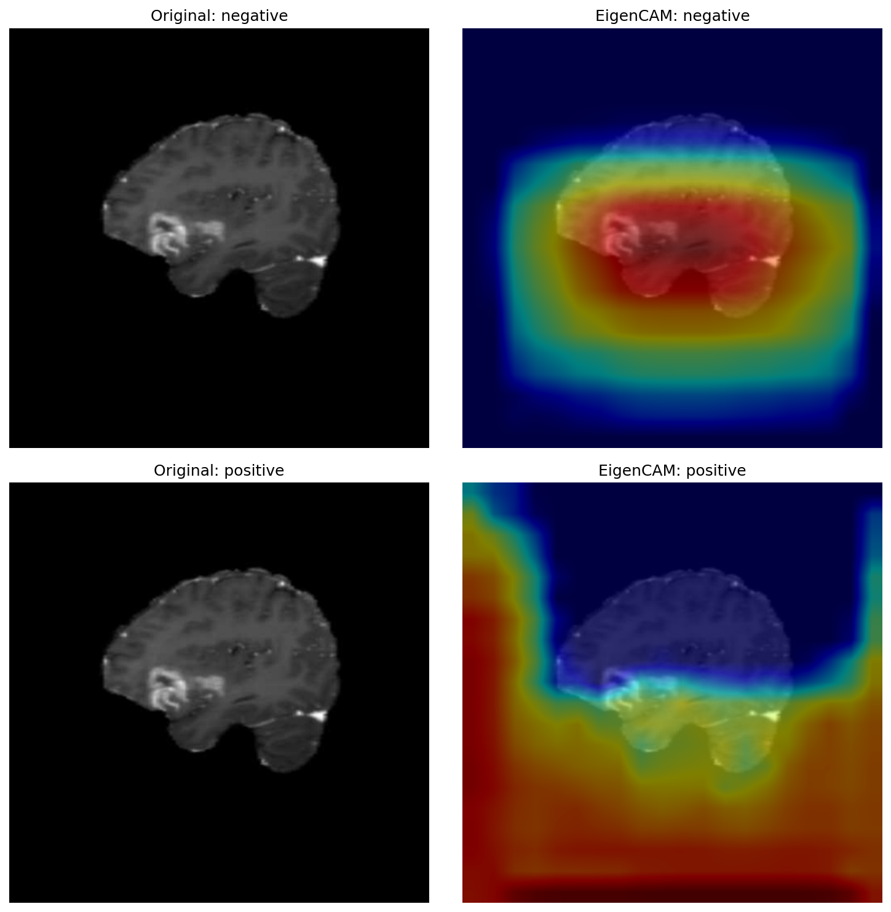

# 🧠 Brain Tumor Detection with YOLOv8

A systematic ablation study on YOLOv8 for brain tumor detection, exploring data augmentation strategies, class weighting, attention mechanisms (CBAM), and Focal Loss for class imbalance.

## 📊 Experiment Results

| Experiment | mAP50 | positive mAP50 | Notes |
|------------|-------|----------------|-------|
| YOLOv8n baseline | 0.501 | 0.396 | Default augmentation |
| YOLOv8n no-aug | 0.542 | 0.459 | Best vanilla config |
| YOLOv8s no-aug | 0.498 | - | Overfitting on small dataset |
| YOLOv8m no-aug | 0.481 | - | Overfitting worsens |
| YOLOv8n cls_pw=0.5 | 0.488 | 0.367 | Class weighting ineffective |
| YOLOv8n + CBAM | 0.496 | 0.377 | Attention ineffective (small data) |
| YOLOv8n + Focal Loss | 0.575 | 0.503 | +6.1% vs best baseline |
| YOLOv8n + Dropout2d on cv3 | 0.575 | 0.503 | +6.1% vs best baseline |
| **YOLOv8n + Focal + Dropout2d** | **0.575** 🏆 | **0.503** | **Performance ceiling reached** |

## 🔑 Key Findings

1. **Data augmentation hurts on MRI data**: Standard augmentations (flip, HSV, mosaic) degrade performance. MRI scans have no natural orientation variance, making geometric augmentations harmful.

2. **Bigger model ≠ better performance**: On this small dataset (~893 training images), YOLOv8s and YOLOv8m overfit significantly compared to YOLOv8n.

3. **CBAM attention is ineffective on small datasets**: Inserting CBAM after P3/P4/P5 backbone stages did not improve mAP50. Pre-trained weights cannot be mapped to the modified architecture, leaving CBAM layers randomly initialized.

4. **Focal Loss effectively addresses class imbalance**: The dataset has a 154:87 (negative:positive) imbalance. Replacing BCE with Focal Loss (γ=1.5, α=0.75) improved mAP50 from 0.542 → 0.575 (+6.1%) and positive mAP50 from 0.459 → 0.503 (+9.6%).

5. **Dropout2d on no-BN layer as independent regularization**: Observed that the last Conv2d in each cv3 scale of the Detect head has no BatchNorm. Inserted Dropout2d(p=0.1) before this layer to avoid BN-Dropout variance shift (Li et al., 2019). Achieved identical improvement (+6.1%) independently of Focal Loss.

6. **Performance ceiling at mAP50=0.575**: Focal Loss, Dropout2d, and their combination all converge to the same result, indicating the bottleneck is data scale (~893 images) rather than model architecture or loss function design.

## 🗂 Dataset

[Ultralytics Brain Tumor Detection Dataset](https://docs.ultralytics.com/datasets/detect/brain-tumor/)
- Train: 893 images | Val: 223 images
- Classes: `negative` (no tumor) / `positive` (tumor present)
- Class distribution (val): negative=154, positive=87

## 🔍 EigenCAM Visualization

EigenCAM applied using [YOLO-26-CAM](https://github.com/rigvedrs/YOLO-26-CAM).

> **Note**: On the `positive` sample, activation shifts toward background corners rather than the tumor region. This reflects a known limitation of EigenCAM on detection models.

## 🛠 Environment
- Platform: AutoDL, RTX 3090
- PyTorch 2.1.0 / Python 3.10 / CUDA 11.8
- Ultralytics 8.4.72

## 📁 Project Structurebrain-tumor-yolov8/ ├── scripts/ │ ├── train_focal.py # Custom Focal Loss trainer │ └── eigencam_yolocam.py # EigenCAM visualization ├── assets/ │ └── eigencam_comparison.png ├── yolov8n-cbam.yaml └── README.md## 📚 References
- [YOLOv8 by Ultralytics](https://github.com/ultralytics/ultralytics)
- [Focal Loss — RetinaNet (Lin et al., 2017)](https://arxiv.org/abs/1708.02002)
- [CBAM (Woo et al., 2018)](https://arxiv.org/abs/1807.06521)
- [YOLO-26-CAM](https://github.com/rigvedrs/YOLO-26-CAM)
